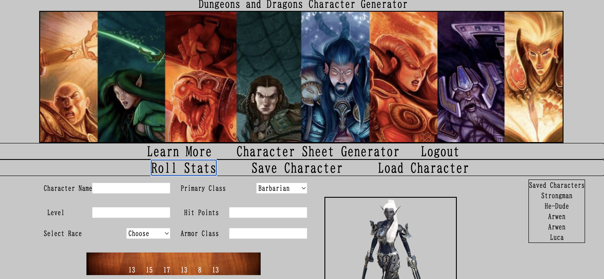

# Advanced Dungeon and Dragons Character Generator

## Description
    
    A RESTful API application to generate, save, and update player character sheets for the roleplaying game AD&D.  We are building this project to ease the management of character storage and updating of statistics and to share our passion for role playing games. Characters can be auto generated or stats can be entered manually. Registered users will be able to access saved character sheets, edit, and delete them. This app will replace maintaining characters on paper

  ## Installation
  To install required dependecies, run the following command:
  npm install

  ## Collaboraters 

# Team Wizards of The Code
- Alexander Lu
- Stephen Fike
- Sarah Cylkowski
- Erik Rockenmeyer
- Travis Swift

  ## Usage
  This app is simple to use.  You fill out the prompts appropriately and the directory is made.
  

 <a href="https://warm-cove-70741.herokuapp.com/">Click here to see the deployed site.</a>

 ## Technologies Used
-   * bcrypt
    * dotenv
    * express
    * express-handlebars
    * express-session
    * foundation-cli
    * Javascript
    * jest
    * mysql2
    * node-fetch
    * sequelize
    * tailwindcss
    

  ## Questions
  If you have any questions, please reach out on <a href="https://github.com/sacylkowski/">GitHub</a> or you can <a href="mailto:sacylkowski@gmail.com">E-mail me</a>.
    

 
